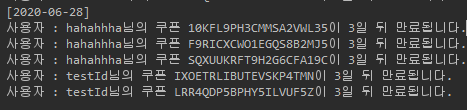
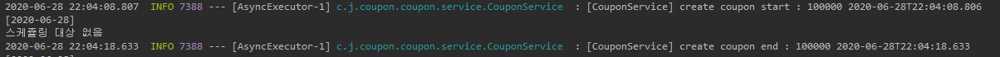

# Coupon Manger Webapp
Coupon Manager Web application.

## 다운로드
[Jar download](./lib/coupon-manager-webapp-0.0.1.jar)

##### 실행 방법
* java -jar coupon-manager-webapp-0.0.1.jar 수행 후 http://localhost:8080 접속
* DB Console의 경우 http://localhost:8080/h2-console 접근 후, JDBC URL 각 DB별 설정
    * Coupon DB : jdbc:h2:mem:coupon
    * Member DB : jdbc:h2:mem:member
* 현재 쿠폰 만료 알림의 경우 10초에 한번씩 만료일자 3일 남은 쿠폰 리스트 출력하도록 설정된 상태입니다.

## Backend 개발환경
* Maven
* Java 8
* SpringBoot 2.3.1
    * H2 Database, JPA
        * 데이터 적재
    * Spring Security
        * 인증 처리 용도
* Jjwt 0.11.2 [Jjwt](https://github.com/jwtk/jjwt)
    * API호출 시 인증처리 용도 
* Lombok
    * 생성자, getter/ setter 자동 생성
        
## API 문서
[postman]
* [Web](https://documenter.getpostman.com/view/1211136/T17AkBN8)
* [File](./documents/coupon-mamager-webapp.postman_collection.json)
    * 쿠폰 생성 API의 경우 만료 테스트 시 expireDayCount 파라미터를 0 혹은 음수로 설정하면 테스트 가능합니다.
    
## 문제 해결 전략
* 쿠폰 사용 테이블 및 처리 시 상태 변경 저장 테이블을 두어 로깅 처리 진행.
* 모든 쿠폰이 중복이 생겨서는 안된다는 전제 하에 개발 진행.

## 개선고려 필요 포인트
* 현재 단일 테이블에 쿠폰 데이터를 적재 및 테이블에 로그를 저장하고 있어 부하 이슈 발생 가능.
* 쿠폰 종류 및 사용 유형별 메타정보 생성(A 쿠폰 이벤트, B 쿠폰 이벤트) 사용하도록 설계 변경 고려 혹은, 유저 ID별 해싱, 혹은 쿠폰 코드별 해싱을 통해 DB샤딩 고려 필요
    * 메타 데이터 redis 등을 사용하여 캐싱 전략 고려
* 현재 사용 API 및 생성 API가 하나의 프로젝트에서 사용, 관리자/ 사용자 대상 프로젝트 분리 필요
* 쿠폰 생성 시 Async를 이용하여 별도 Thread에서 생성을 진행하는데, 생성 요청 시 별도 테이블 등에 쿠폰 생성 진행 기록 후, Thread에서 생성 완료 시 해당 테이블에 완료 기록 하여 생성요청 완료 조회 가능하도록 개선 필요 

## 참고 스크린샷
* 쿠폰 만료 안내
    * 
* 쿠폰 생성
    * 